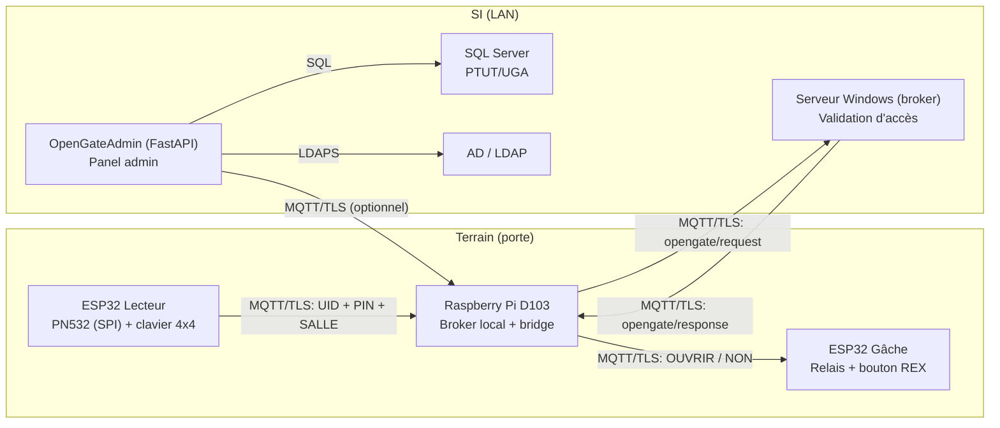

# OpenGate

Contrôle d’accès **souverain** (LAN only, sans cloud) pour salles/locaux : ouverture via **badge RFID** + **PIN**, pilotage d’une **gâche Fail‑Safe**, et **panel d’administration** (web) avec intégration **AD/LDAP** et **SQL Server**.

Ce dépôt contient **tout le code** de la chaîne OpenGate :
- `esp32/` : firmwares terrain (Lecteur + Gâche)
- `Rasberry PI/` : code passerelle Raspberry Pi (broker local + bridge MQTT)
- `OpenGateAdmin/` : panel d’administration (FastAPI) + API (LDAP/SQL/MQTT)

## Vue d’ensemble



## Flux MQTT (topics & formats)

### 1) Lecteur -> Raspberry Pi

- Topic : `opengate/D103/lecteur`
- Payload attendu (côté Raspi) : `UID|PIN|SALLE`

Exemple : `04A1B2C3|1234|D103`

> Note : dans `esp32/lecteur.ino`, le format envoyé est actuellement `UID|PIN|SALLE` (à vérifier/adapter si vous changez l’ordre).

### 2) Raspberry Pi -> Serveur Windows (validation)

- Topic : `opengate/request`
- Payload : réutilise le payload lecteur (ex : `UID|PIN|D103`)

Le serveur de validation publie ensuite :
- Topic : `opengate/response`
- Payload : une réponse contenant `true` / `false` (ou texte “a accès”)

### 3) Raspberry Pi -> Gâche

- Topic : `opengate/D103/gache`
- Payload : `OUVRIR` ou `NON`

## Arborescence

- `esp32/lecteur.ino` : ESP32 lecteur RFID + clavier, envoi d’une requête d’accès
- `esp32/gache.ino` : ESP32 actionneur de gâche + bouton REX
- `Rasberry PI/main.py` : bridge MQTT (local <-> serveur Windows) + logs
- `Rasberry PI/mosquitto.conf` : base Mosquitto (inclut `conf.d`)
- `OpenGateAdmin/` : panel web (FastAPI + Jinja2)

## Prérequis (général)

- Réseau LAN (SSID du projet) : ex `OpenGate-D103`
- Un broker MQTT local sur le Raspberry Pi (port TLS 8883)
- Un broker MQTT “serveur” côté Windows (port TLS 8883) + un service de validation qui répond sur `opengate/response`
- SQL Server accessible pour `OpenGateAdmin` (ou adaptation du backend DB)
- AD/LDAP accessible si authent LDAP activée

## ESP32

### Prérequis

- Arduino IDE (ou PlatformIO)
- Package cartes “ESP32 by Espressif Systems”
- Librairies :
  - `PubSubClient`
  - `Adafruit PN532`
  - `Keypad`

### 1) Firmware Lecteur : `esp32/lecteur.ino`

Rôle :
- Lit un badge via PN532 (SPI)
- Demande un PIN (4 chiffres) via clavier 4x4
- Publie une requête MQTT au format `UID|PIN|SALLE`

Paramètres importants :
- Wi‑Fi : `ssid`, `password`
- IP statique : `local_IP`, `gateway`, `subnet`
- MQTT/TLS : `mqtt_server`, `mqtt_port` (= 8883), `ca_cert`
- Salle : `id_salle` (ex `D103`)
- Topics : `topic_envoi` (lecteur) et `topic_recep` (retour LED)

Pins :
- PN532 (SPI) :
  - `PN532_SCK = 4`
  - `PN532_MISO = 3`
  - `PN532_MOSI = 1`
  - `PN532_SS = 0`
- Clavier 4x4 :
  - lignes : `{5, 6, 7, 8}`
  - colonnes : `{9, 10, 20, 21}`
- LED : `LED_PIN = 2`

### 2) Firmware Gâche : `esp32/gache.ino`

Rôle :
- Reçoit `OUVRIR` sur `opengate/D103/gache`
- Met le relais dans l’état “ouvert” pendant une temporisation
- Permet une ouverture locale via bouton intérieur (REX)

Pins :
- `RELAY_PIN = 7`
- `BUTTON_PIN = 9` (en `INPUT_PULLUP`)

⚠️ Important (Fail‑Safe)  
Le code est écrit pour un montage où l’état **HIGH** au repos maintient le verrouillage (et une mise à **LOW** ouvre). Si votre relais/transistor est inversé, inversez simplement `HIGH/LOW` dans `ouvrir_porte()`.

## Raspberry Pi (passerelle D103)

Code : `Rasberry PI/main.py`

Rôle :
- Se connecte au broker local (Mosquitto sur le Raspi) et s’abonne au topic lecteur
- Transfère la requête vers le broker Windows (`opengate/request`)
- Récupère la réponse (`opengate/response`)
- Envoie le verdict à la gâche (`OUVRIR` / `NON`)
- Log dans `/var/log/opengate.log`

### Installation conseillée (Raspberry Pi OS Lite)

1. Installer Mosquitto + outils :

```bash
sudo apt update
sudo apt install -y mosquitto mosquitto-clients python3-venv
```

2. Préparer les certificats CA attendus par le script :

- `CERT = /etc/mosquitto/ca_certificates/ca.crt` (CA du broker local)
- `CERTBDD = /etc/mosquitto/ca_certificates/caBDD.crt` (CA du broker Windows)

3. Créer un environnement Python + dépendances :

```bash
mkdir -p ~/OPT_OpenGate
cp -r \"Rasberry PI\"/* ~/OPT_OpenGate/
cd ~/OPT_OpenGate
python3 -m venv venv
source venv/bin/activate
pip install paho-mqtt
```

4. Lancer :

```bash
python main.py
```

> Le script se connecte à `raspi-D103.opengate.local:8883` (local) et à `srv-bdd.opengate.net:8883` (serveur). Adaptez `BROKER_LOCAL` / `MAIN_SRV` si vos DNS ne correspondent pas.

### Mosquitto (broker local)

Le fichier `Rasberry PI/mosquitto.conf` est un “socle” et inclut `/etc/mosquitto/conf.d/`.  
La bonne pratique est d’ajouter votre listener TLS dans un fichier dédié, par ex :

`/etc/mosquitto/conf.d/opengate.conf` (exemple minimal) :

```conf
listener 8883
protocol mqtt
allow_anonymous false
password_file /etc/mosquitto/passwd

cafile /etc/mosquitto/ca_certificates/ca.crt
certfile /etc/mosquitto/certs/server.crt
keyfile /etc/mosquitto/certs/server.key
```

Puis :

```bash
sudo systemctl enable mosquitto
sudo systemctl restart mosquitto
```

## OpenGateAdmin (panel web)

Code : `OpenGateAdmin/`

Fonctions principales :
- Authentification via LDAP (LDAPS) ou base (table `OGA_Users`)
- Gestion portes (listing + verrouillage)
- Ouverture à distance via MQTT (si `dev = False`)

### Installation

Depuis `OpenGateAdmin/` :

```powershell
python -m venv .venv
.\.venv\Scripts\pip install -r .\requirements.txt
```

### Configuration

- JWT : `OpenGateAdmin/.env` doit contenir `API_TOKEN_KEY=...`
- LDAP : `OpenGateAdmin/config.ini` (`[LDAP] server/port/domain/filtre`)
- SQL Server : `OpenGateAdmin/core/database_manager.py` (chaîne ODBC)
- MQTT (optionnel) : dans `OpenGateAdmin/main.py`, mettre `dev = False`

### Lancement

```powershell
.\.venv\Scripts\python.exe .\main.py
```

Ou Uvicorn :

```powershell
.\.venv\Scripts\uvicorn.exe main:app --host 0.0.0.0 --port 8000 --reload --ssl-keyfile .\key.pem --ssl-certfile .\cert.pem
```

URL : `https://localhost:8000/`

## Points d’attention (sécurité & “repo hygiene”)

- Ce dépôt contient des éléments sensibles (ex : `.env`, clés/certificats). En production/publication :
  - ne jamais versionner les secrets (`.env`, clés privées)
  - utiliser des variables d’environnement ou un coffre (Vault)
- MQTT/TLS : le port 8883 garantit TLS (sinon la connexion échoue).
- Fail‑Safe : la sûreté des personnes prime (comportement “déverrouillé” en cas de défaut d’alim selon le montage choisi).

## Équipe

- Théo Blachère
- Joris Mandon
- Sacha Renard
- Axel Vidaud

